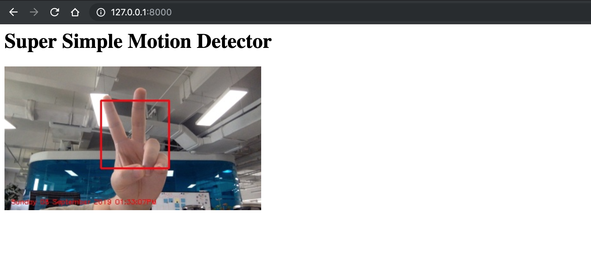

## Simple Motion Detection on Web Browser

### Introduction
The repo is a toy project based on PyImageSearch Blog post [OpenCV Stream Video to Web Browser Html Page](https://www.pyimagesearch.com/2019/09/02/opencv-stream-video-to-web-browser-html-page/#post_downloads) meant to learn how to perform super simple motion detection against video stream and display result on web browser.

### Setup Virtualenv (macos tested only, linux should work)
This repo uses pipenv to setup virtualenv and manage packages and requires Python 3.6+ 
1. The pipenv installation steps can be found [here](https://github.com/pypa/pipenv)
2. Run `pipenv install` in root dir of this repo to install packages, including `flask`, `opencv`, `imutils`, `numpy`

### Run simple motion detection demo
1. Run `pipenv shell` under root dir of repo to enter virtualenv
2. Run `python webstreaming.py -i 0.0.0.0 -p 8000` to start flask server
3. Visit `http://127.0.0.1:8000` and there will be a live video stream!

4. Press `Ctrl C` to stop the demo
